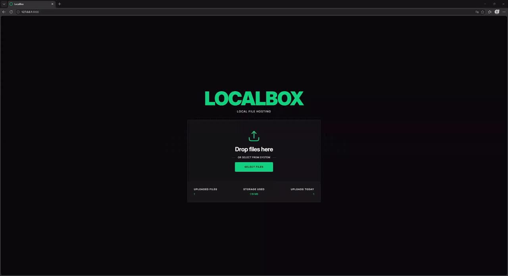

<div align="center">
  <h1>LocalBox</h1>
  <p>Lightweight, self-hosted file sharing for your local network.</p>
  <p>
    
    
    
    
    
    
  </p>
</div>

## Overview

LocalBox is a small file sharing application for quickly moving files between devices on the same network. It's designed to be minimal and easy to run in a container.

- Drag-and-drop uploads that switch between direct and chunked transfer automatically, so large files upload reliably.
- Files uploaded together are grouped and shared through a single link.
- Minimal, distraction-free interface focused on the task at hand.
- Admin dashboard for managing uploaded files and user accounts.

## Preview



## Getting started

### 1. Run with Docker

For the fastest setup, run the prebuilt Docker image:

```bash
docker run -d \
  --name localbox \
  -p 8000:80 \
  -v localbox-var:/app/var \
  -v localbox-storage:/storage \
  ghcr.io/r1pk/localbox:latest
```

Once launched, the application is available on the host's port `8000`, with two named volumes that keep your data intact between restarts:

- `localbox-var` - stores the application's working data, including the SQLite database.
- `localbox-storage` - stores the uploaded files.

### 2. Open the application

Two entry points become available once the container is running:

- Home ([http://127.0.0.1:8000](http://127.0.0.1:8000)) - the public-facing page where users upload files and share them with others.

- Admin dashboard ([http://127.0.0.1:8000/admin](http://127.0.0.1:8000/admin)) - a simple panel for reviewing uploaded files and managing user accounts.

> [!IMPORTANT]
> Default credentials are `admin` / `admin`.

## Configuration

Everything is set through environment variables. Each variable has a sensible default, so no further configuration is typically required.

| Variable                  | Default                                        | Description                                   |
|---------------------------|------------------------------------------------|-----------------------------------------------|
| `LOCAL_STORAGE_DIRECTORY` | `/storage`                                     | Absolute path where uploaded files are saved. |
| `DATABASE_URL`            | `sqlite:///%kernel.project_dir%/var/sqlite.db` | Doctrine DSN for the database.                |

## Development

The repository includes a Docker Compose configuration that mirrors the production setup and enables debugging tools such as Xdebug, making it the recommended way to develop the project.

1. Clone the repository:

```bash
git clone https://github.com/r1pk/localbox.git
cd localbox
```

2. Build and start the containers:

```bash
docker compose up -d --build
```

3. Run the setup script to prepare the application and create the default admin user:

```bash
docker compose exec php bash /app/setup.sh
```

Once the setup completes, the application is available at [http://127.0.0.1:8000](http://127.0.0.1:8000).

## License

Licensed under the [MIT License](LICENSE.md).

## Author

**Patryk Krawczyk** - [@r1pk](https://github.com/r1pk)
